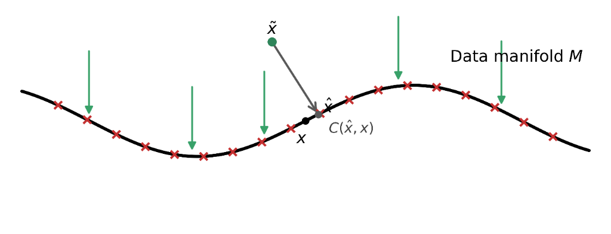
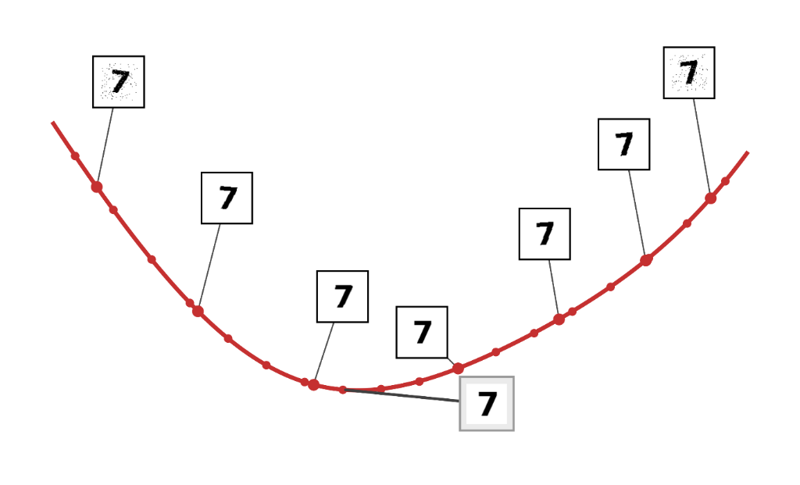

### Theory

**Introduction to Autoencoders**

Autoencoders are a type of neural network used for unsupervised learning of efficient data representations. Unlike supervised learning methods that require labeled data, autoencoders learn useful features by attempting to reconstruct their input. The main idea is to compress the input into a lower-dimensional representation and then reconstruct the original input from this compressed form using an encoder–decoder architecture.

> *"High-dimensional data can be converted to low-dimensional codes by training a multilayer neural network with a small central layer to reconstruct high-dimensional input vectors."*
>
> — Hinton & Salakhutdinov, Science, 2006

The model is trained to minimize reconstruction error, so it learns to preserve the most important information while discarding unnecessary detail. This makes autoencoders useful for dimensionality reduction, compression, denoising, and feature learning.

An autoencoder consists of two main parts:

* **Encoder**: converts the input into a latent-space representation
* **Decoder**: reconstructs the input from the latent representation

**Types of Autoencoders:**

**Basic Autoencoder:**

A basic autoencoder is trained on clean input images. The input passes through the encoder, which compresses it into a latent vector. The decoder then reconstructs the original image from that vector. The bottleneck layer forces the model to learn a compressed representation that captures the main structure of the input while discarding redundant information.
This type of autoencoder is useful when the goal is to learn compact features from clean data.

**Denoising Autoencoder:**

A denoising autoencoder is trained to reconstruct a clean image from a corrupted version of the same image. If the clean input is represented as $x$, then the noisy input can be written as:

$$ \tilde{x} = x + n $$

where $n$ is random noise. The noisy image $\tilde{x}$ is given as input to the model, but the target output remains the original clean image $x$. The model learns to remove the noise and recover the underlying structure of the image.
This helps the autoencoder learn features that are robust to corruption and useful for practical reconstruction tasks.

The training process for a denoising autoencoder can be written as:

* **Input:** $\tilde{x}$ (noisy image)

* **Target:** $x$ (clean image)

* **Loss:** $\mathcal{L}\!\left(x,\, g\!\left(f\!\left(\tilde{x}\right)\right)\right)$

The reconstruction loss is computed by comparing the decoder's output with the original clean image. This forces the network to learn features that are resilient to noise and capture the underlying structure of the data.

*Figure 1 — Geometric interpretation of a denoising autoencoder*

This figure illustrates the manifold-learning interpretation of a denoising autoencoder (DAE). The black curve, denoted as the data manifold $M$, represents the low-dimensional structure on which clean data samples naturally lie. The red crosses correspond to clean training samples $x$ distributed along this manifold. During training, a clean sample $x$ is artificially corrupted to produce a noisy version $\tilde{x}$ (green point), which lies away from the manifold. The denoising autoencoder processes this corrupted input through an encoder–decoder mapping and produces a reconstruction $\hat{x}$ (gray point) that is pushed back toward the manifold and close to the original clean sample. The reconstruction error $C(\hat{x},\, x)$ measures the discrepancy between the reconstructed sample and the true clean sample and is minimised during training. The green arrows along the manifold represent the learned denoising vector field, indicating that the autoencoder learns to move corrupted inputs toward regions of high data density on the manifold. Consequently, the DAE not only reconstructs clean samples from noisy observations but also learns the underlying geometric structure of the data distribution.

*Figure 2 — Denoising autoencoder reconstruction on the learned manifold of handwritten digit 7*

This figure illustrates the learned latent manifold of handwritten digit **7** representations in a denoising autoencoder. The red curve represents a low-dimensional manifold in latent space, where each point corresponds to a latent code whose decoded image is shown in the associated box. The smoother and cleaner digit images near the centre indicate regions of higher data density, while the noisier images toward the ends represent less representative latent states. The arrow ($\rightarrow$) depicts the denoising process, where corrupted representations are guided toward the manifold, resulting in a cleaner reconstructed digit that preserves the essential characteristics of the original input.

**Latent Space Representation:**

The latent space (bottleneck layer) is the compressed representation learned by the encoder. It is the stacked layers in the encoder, its depth, that enable autoencoders to learn hierarchical representations of data, where early layers capture low-level features (such as edges and textures) and deeper layers capture increasingly abstract patterns. The bottleneck itself plays a separate but equally important role: by constraining the dimensionality, it forces the network to retain only the most essential information and discard redundancy.

For visualisation purposes, a 2-dimensional latent space is often used. When the latent dimension is 2, the encoded representations of input images can be directly plotted as a scatter plot to observe how the autoencoder organises different patterns in the data. Similar fashion items tend to cluster together in the learned latent space, indicating that the autoencoder has learned meaningful and discriminative representations.

**Fashion-MNIST Dataset**

Fashion-MNIST is a dataset of grayscale images representing 10 different fashion categories. Each image is $28 \times 28$ pixels. The 10 classes are:

1. T-shirt/top
2. Trouser
3. Pullover
4. Dress
5. Coat
6. Sandal
7. Shirt
8. Sneaker
9. Bag
10. Ankle boot

This dataset is commonly used for testing machine learning algorithms because it is more challenging than standard MNIST digits while maintaining the same image format.

**Merits of Autoencoders**

* **Unsupervised Learning**: No labelled data required for training
* **Dimensionality Reduction**: Learns compact representations of high-dimensional data
* **Noise Reduction**: Denoising autoencoders can remove noise from corrupted data
* **Feature Learning**: Automatically discovers useful features without manual engineering
* **Data Compression**: Can be used for efficient data storage and transmission

**Demerits of Autoencoders**

* **Reconstruction Quality**: May not perfectly reconstruct complex images
* **Training Complexity**: Requires careful tuning of architecture and hyperparameters
* **Computational Cost**: Deep autoencoders require significant training time
* **Task-Specific**: Representations learned may not transfer well to other tasks
