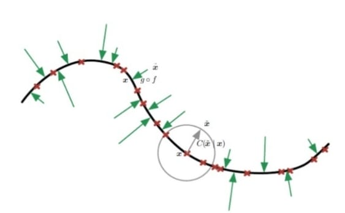
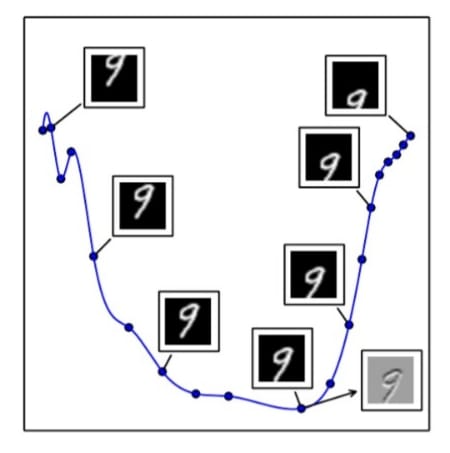

### Theory

**Introduction to Autoencoders**

Autoencoders are a type of neural network used for unsupervised learning of efficient data representations. Unlike supervised learning methods that require labelled data, autoencoders learn useful features by attempting to reconstruct their input. The main idea is to compress the input into a lower-dimensional representation and then reconstruct the original input from this compressed form using an encoder-decoder architecture.

> "High-dimensional data can be converted to low-dimensional codes by training a multilayer neural network with a small central layer to reconstruct high-dimensional input vectors."
>
> - Hinton & Salakhutdinov, Science, 2006

An autoencoder consists of two main parts:

* **Encoder**: Compresses the input into a latent-space representation (bottleneck layer)
* **Decoder**: Reconstructs the input from the latent representation

The network is trained to minimise the difference between the input and its reconstruction, forcing it to learn the most important features of the data.

**Basic Autoencoder:**

A basic autoencoder learns to compress and reconstruct clean input data. The input image is passed through the encoder, compressed into a bottleneck (latent) representation, and then reconstructed by the decoder. 
The bottleneck layer forces the network to learn a compressed representation that captures the essential features of the input while discarding redundant information.

**Denoising Autoencoder:**

> "A denoising autoencoder is trained to reconstruct a clean 'repaired' input from a corrupted version of it."
>
> - Vincent et al., ICML 2008

A denoising autoencoder is trained to reconstruct a clean "repaired" input from a corrupted version of it. In this case, noise is deliberately added to the input image, and the corrupted image is then fed into the autoencoder. The decoder attempts to reconstruct the original clean image rather than the noisy input.

*Figure 1- Denoising autoencoder*  
*(Source: Deep Learning. Ian Goodfellow, Yoshua Bengio, and Aaron Courville, MIT Press.)*

A denoising autoencoder is trained to map a corrupted data point x' back to the original data point x as shown in Figure 1. We illustrate training examples x as red crosses lying near a low-dimensional manifold illustrated with the bold black line. We illustrate the corruption process C (x' | x) with a gray circle of equiprobable corruption. A gray arrow demonstrates how one training example is transformed into one sample from this corruption process.

The training process for a denoising autoencoder can be written as:

1. **Corrupted input:** $\tilde{x} = x + n \cdot x$, where $n$ is random noise sampled from $\mathcal{N}(0, \sigma^2)$
2. **Target:** $x$ (the original clean image)
3. **Reconstruction loss:** $\mathcal{L}(x,\, g(f(\tilde{x}))) = \|x - g(f(\tilde{x}))\|^2$

The reconstruction loss is computed by comparing the decoder's output with the original clean image. This forces the network to learn features that are resilient to noise and capture the underlying structure of the data.

**Latent Space Representation:**

Latent space (bottleneck layer) is the compressed representation learned by the encoder. This compression enables autoencoders to learn hierarchical representations of data.

For visualisation purposes, a 2-dimensional latent space is often used. When the latent dimension is 2, the encoded representations of input images can be directly plotted to observe how the autoencoder organises different patterns in the data.

Similar fashion items tend to cluster together in the learned latent space, indicating that the autoencoder has learned meaningful and discriminative representations.

*Figure 2- Reconstructed Image After Noise Removal*  
*(Source: Deep Learning. Ian Goodfellow, Yoshua Bengio, and Aaron Courville, MIT Press.)*

**Merits of Autoencoders**

1. **Unsupervised Learning**: No labelled data required for training
2. **Dimensionality Reduction**: Learns compact representations of high-dimensional data
3. **Noise Reduction**: Denoising autoencoders can remove noise from corrupted data
4. **Feature Learning**: Automatically discovers useful features without manual engineering
5. **Data Compression**: Can be used for efficient data storage and transmission

**Demerits of Autoencoders**

1. **Reconstruction Quality**: May not perfectly reconstruct complex images
2. **Training Complexity**: Requires careful tuning of architecture and hyperparameters
3. **Computational Cost**: Deep autoencoders require significant training time
4. **Task-Specific**: Representations learned may not transfer well to other tasks.
